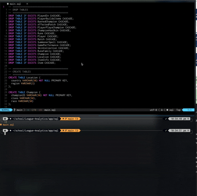
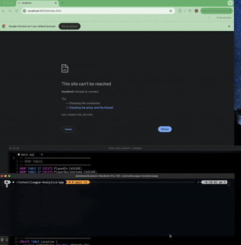
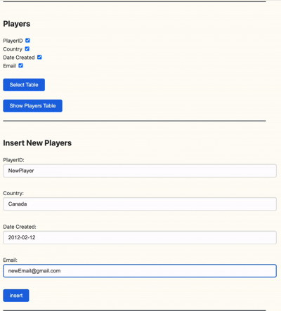
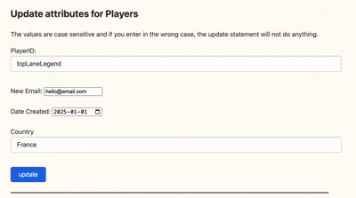
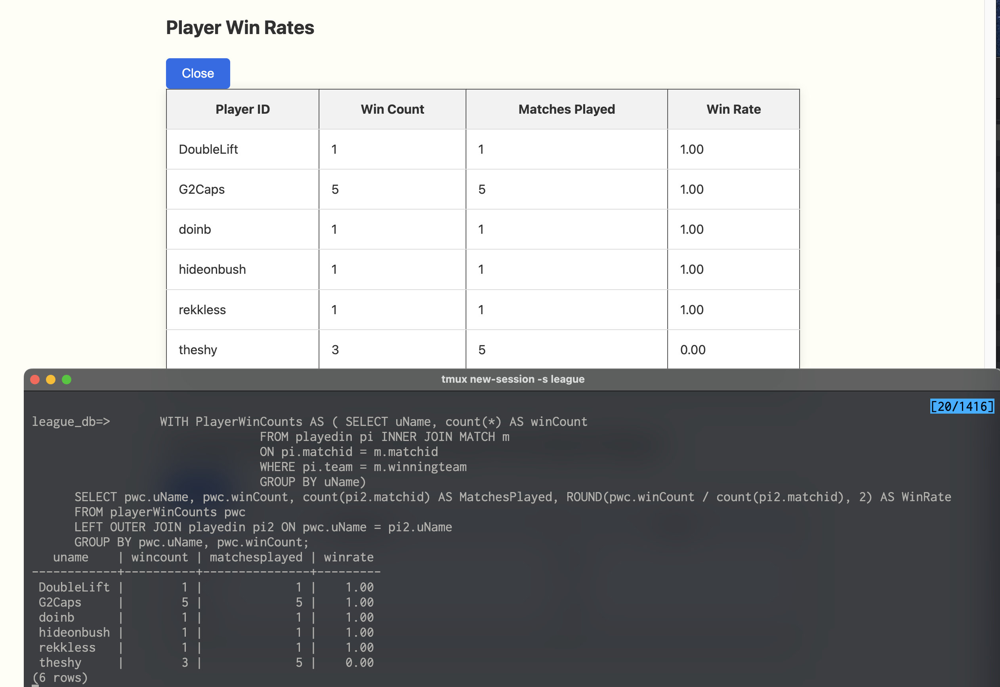
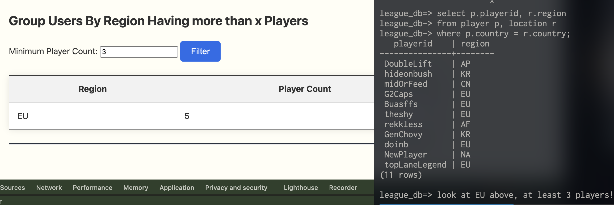
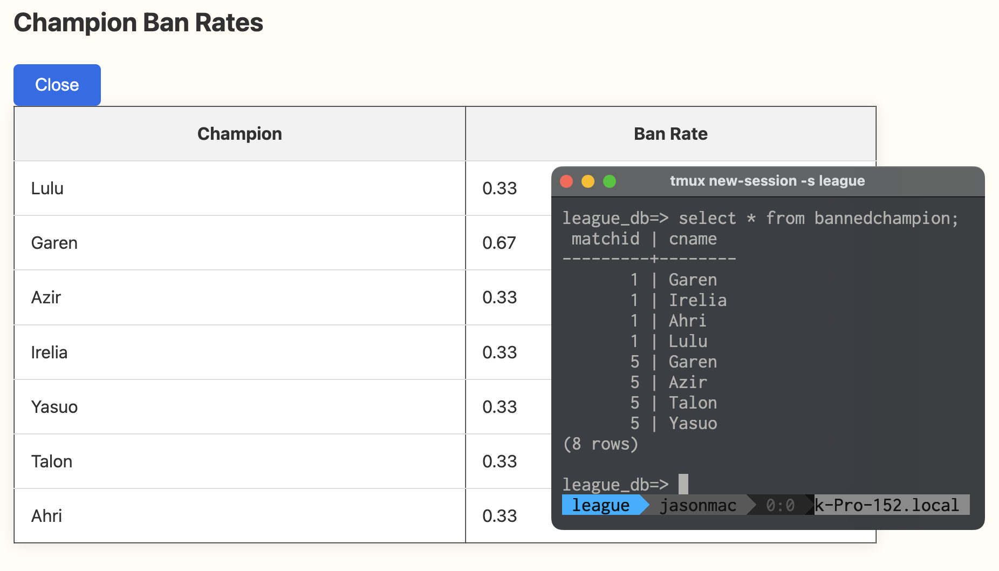
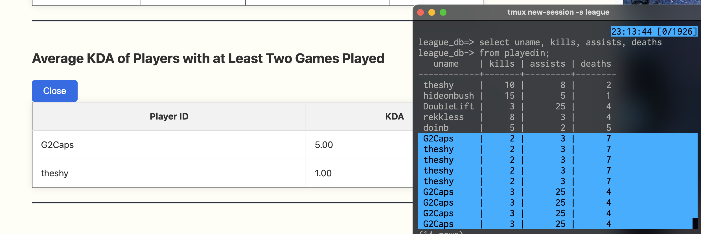

# LOL Data 📊

This was a group project done at UBC for CPSC 304, Database Management Systems.

## Project Description 
An application that stores player match data for the game *League of Legends*. Information about player history, match turnouts, previous builds, regional playerbases and champions. 

---

## User Features

### 1. Full Match History  
The *League of Legends* client only displays the 20 most recent matches. For active players, this limit is quickly reached. *LOL Data* allows users to:

- View all their previous matched played  
- Keep record of teammates and opponents
- View performance trends 

### 2. Match Optimization  
Given the competitive setting of *League of Legends* players are often interested on what other players are doing to improve their own playstyles. *LOL Data* helps players improve by offering:

- Access to match data from other users  
- Champion builds and team compositions
- Players with significant performance under certain roles/champions

 ### 3. Interests
 *League of Legends* has an enriched community with fans coming from their competitive scene and/or TV show *Arcane*. Players will be able to indulge in their interests as *LOL Data* offers:

- Record of all champion classes and races 
- Global player search 

---

## Developer Uses

### 1. Game Balance
To ensure a fair player-experience among their entire community, match data is a reliable source of information. *LOL Data* will allow developers to identify team compositions, builds and champions with performance deviating from averages. 

### 2. Patch Maintenance
Patches are roled out often and so it is important that developers can easily identify what the game state is up to a certain date.

### Citations:
Utilized CPSC304 Node Project template: https://github.students.cs.ubc.ca/CPSC304/CPSC304_Node_Project

## Demoing My Main Contributions

Amongst three group members, we all had an opportunity to interact with the frontend and backend code. As this course is less focused on front
end client code, we were mainly responsible for writing efficient queries.

Each of us were responsible for database design and schemas. 

The following showcases the core responsibilities I had in this course project.

NOTE: This project originally used an Oracle database for storing data. I no longer have to the school's Oracle Database so I ported this entire project from Oracle to Postgres. The following demo showcases queries written in Postgres that I was originally responsible for.

### Demo 1: Init Database using Postgres

### Demo 2: Server Initializaion, Frontend Showcase

### Demo 3: Insert Player Into Database

### Demo 4: Update Player Info From Database

### Demo 5: Player Win Rate Qeury

### Demo 6: Player Count By Region Qeury

### Demo 7: Champion Ban Rate

### Demo 8: Average Player KDA Qeury

